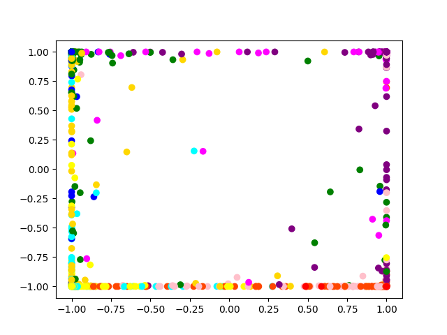
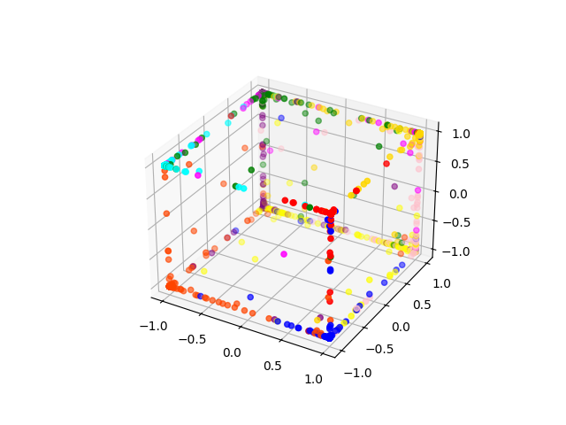

# MultilayerPerceptron
This is a Multilayer Perceptron for optical-digit classification. Train the MLP using the optdigits train.txt data, tune the minimum node entropy using optdigits valid.txt data, and test the prediction performance using the optdigits test.txt data. For each file, the first 64 columns correspond to the binary features for different samples while the last one stores the labels.
# Visualization of the data by values of their hidden units
- Different colors represent different digits
- axes range from -1 - 1 due to the use of Tanh activation function

- Some data may need to be mapped to higher dimensions for better separation

- Better separated features for different classes indicate stronger discriminative power 
